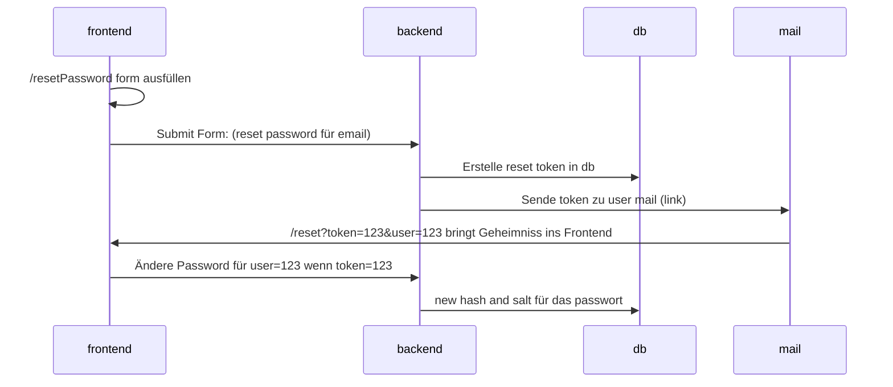

# FullStack Template

## Getting Started

- Erstelle einen neuen Ordner z.b `exercise`
- `cd exercise`
- `git clone git@github.com:VZ-FS-23-02/fs-template.git .`
- Verbindung mit dem template repository aufheben
- `trash .git`
- git repo neu initialisieren `git init`

### Install Dependencies

- installiere Dependencies
  - im Project root
  - ./frontend/
  - ./backend/

`npm i && cd frontend && npm i && cd ../backend && npm i`

## Auth Flow Schema

Details in [Figma](https://www.figma.com/file/THcDMTloZHZr8mwuOwKAKo/VZ-FS-23-02-BackEnd?type=whiteboard&node-id=67-361&t=LU1My8uKoy6EJMhN-4)

